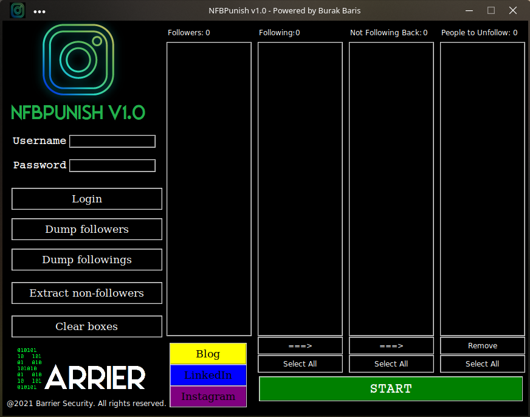

# NFBPunish
NFBPunish is an Instagram unfollower software with a GUI. 
It automatically produces lists for both users you follow and who follow you, then
combs out the users whom not following you back, after that you can
automatically unfollow all those users with one click.
<br>
<br>


## Prerequisities
* Python3
* Pip3
* Mozilla Firefox
## Installiaton

```
git clone https://github.com/krygeNNN/NFBPunish
```
For Windows:<br>
Run `setup.bat`
<br>
Download win64.zip extensioned zip file from 
<br>
`https://github.com/mozilla/geckodriver/releases/tag/v0.30.0`
<br>
and move the executable in the NFBPunish file.
<br>

For Linux:<br>
Run `setup.sh`
<br>
Run `sudo pacman -S tk` for Arch, or `sudo apt install tk` for Debian.
<br>
Download linux64-tar-gz extensioned tar file from 
<br>
`https://github.com/mozilla/geckodriver/releases/tag/v0.30.0`
<br>
and move the executable in the NFBPunish file.
<br>

## Run
`python NFBPunish.py`
